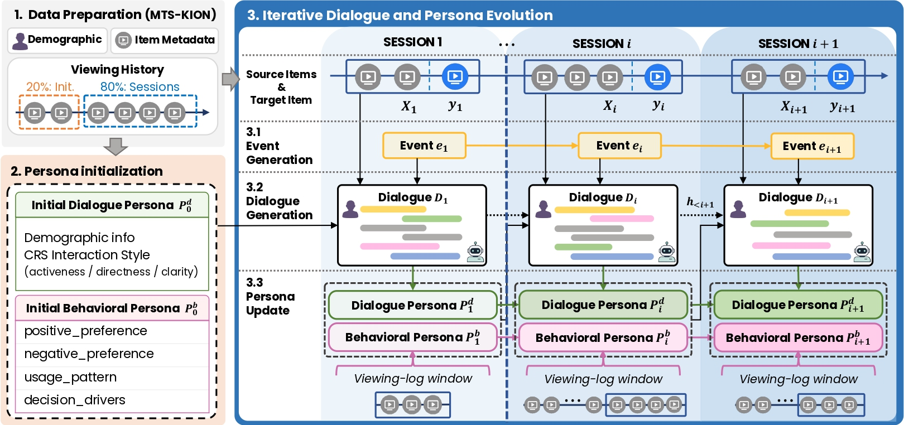

# TRACE: A Long-Term Conversational Recommendation Dataset with Evolving User Personas

This repository contains the code and dataset for **TRACE**
(**T**emporally-grounded **R**ecommendation with **A**ligned **C**onversations
and **E**volving personas), accepted to **EMNLP 2026** 💫.

TRACE is a long-term, multi-session conversational recommendation dataset built
from temporally ordered viewing histories. It grounds LLM-generated
recommendation dialogues in user behavioral trajectories and maintains two
evolving user representations:

- **Behavioral personas**, which summarize implicit long-term viewing patterns.
- **Dialogue personas**, which summarize conversational traits and explicit
  preferences expressed during CRS interactions.

The repository also includes **EvoCRS**, a persona-based CRS framework used to
validate TRACE through persona processing, response generation, candidate
curation, reranking, and evaluation.



## Repository Layout

```text
codes/
  trace/
    gpt-4o-generation/       # TRACE data construction pipeline
    persona_eval/            # Persona quality and diversity evaluation
  evocrs/
    preprocess/              # Training and evaluation data builders
    train/                   # SFT training scripts for EvoCRS components
    infer/                   # Persona, response-generation, and reranking inference
  candidate_curation/        # Candidate curator training code
data/
  trace/gpt-4o-generated/    # Released TRACE dialogue data
  trace/persona_eval/        # Released persona-evaluation outputs
  test_session_ids_without_first_session.json
```

## Dataset

The released TRACE data is stored as:

```text
data/trace/gpt-4o-generated/final_crs_dataset.json.gz
```

To use scripts that expect an uncompressed JSON file, run:

```bash
gzip -dk data/trace/gpt-4o-generated/final_crs_dataset.json.gz
```

The released dataset contains:

- 1,136 users
- 8,168 dialogue sessions
- 7.19 sessions per user on average
- 12.97 utterances per session on average

Each session contains the dialogue, source and target items, behavioral persona
states, dialogue persona states, and session-level metadata.

## Setup

Set the repository root before running commands:

```bash
cd /path/to/TRACE
export SUPPLEMENTARY_ROOT=$(pwd)
```

Install the Python packages required by the scripts you plan to run. The full
pipeline uses packages including:

```bash
pip install torch transformers accelerate deepspeed peft bitsandbytes \
  sentence-transformers scikit-learn numpy tqdm python-dotenv openai \
  google-generativeai diskcache wandb
```

Some scripts require local model paths and API keys. Configure them before
running the corresponding pipeline:

```bash
export HF_MODEL_DIR=/path/to/huggingface/models
```

Create `.env` when using LLM-based TRACE generation or persona evaluation:

```text
OPENAI_API_KEY=your_openai_api_key
GEMINI_API_KEY=your_gemini_api_key
```

## TRACE Construction Pipeline

TRACE is constructed from MTS-KION viewing histories. The raw MTS-KION-derived
input expected by the generation scripts is:

```text
data/original_user_data.json
```

The construction pipeline follows the paper:

1. Split each user trajectory into an initialization split and an update split.
2. Segment the update split into temporally ordered recommendation sessions.
3. Initialize behavioral personas from early viewing logs.
4. Initialize dialogue personas from demographic attributes and interaction
   styles.
5. Generate session events.
6. Generate persona-conditioned recommendation dialogues.
7. Update behavioral and dialogue personas after each session.

Run the released construction scripts in order:

```bash
python codes/trace/gpt-4o-generation/preprocess/split_init_and_update.py
python codes/trace/gpt-4o-generation/preprocess/split_sessions.py
python codes/trace/gpt-4o-generation/preprocess/behavioral_persona_init.py
python codes/trace/gpt-4o-generation/preprocess/dialogue_persona_init.py
python codes/trace/gpt-4o-generation/preprocess/event_generation.py
bash codes/trace/gpt-4o-generation/run_behavioral_persona_update.sh
bash codes/trace/gpt-4o-generation/run_dialogue_generation.sh
```

## EvoCRS Data Builders

Build training and ranking data for EvoCRS:

```bash
bash codes/evocrs/preprocess/training/build.sh \
  behavioral_persona_extract \
  dialogue_persona_extract \
  persona_update \
  listwise_ranking_v13
```

Supporting builders are included under:

```text
codes/evocrs/preprocess/intermediate_builders/
codes/evocrs/preprocess/evaluation/
```

## Training

Train the candidate curator:

```bash
bash codes/candidate_curation/train/train_candidate_curator.sh
```

Train the EvoCRS persona processor and response generator:

```bash
bash codes/evocrs/train/sft/train_bp_extractor.sh
bash codes/evocrs/train/sft/train_dp_extractor.sh
bash codes/evocrs/train/sft/train_p_updater.sh
bash codes/evocrs/train/sft/train_response_generator_w_p.sh
bash codes/evocrs/train/sft/train_response_generator_wo_p.sh
```

Train the public reranker configuration:

```bash
bash codes/evocrs/train/sft_ranker/train_ranker.sh
```

Before training, update script-local values such as `CUDA_VISIBLE_DEVICES`,
`HF_MODEL_DIR`, `WANDB_API_KEY`, and checkpoint/output paths for your machine.

## Inference

Run persona processor inference:

```bash
bash codes/evocrs/infer/persona_processor/run_persona_pipeline.sh qwen
bash codes/evocrs/infer/persona_processor/run_persona_pipeline.sh llama
```

Run response generation and reranking:

```bash
bash codes/evocrs/infer/response_generator/infer_with_persona_llama31.sh
bash codes/evocrs/infer/response_generator/infer_without_persona_llama31.sh
bash codes/evocrs/infer/response_generator/infer_with_persona_qwen25.sh
bash codes/evocrs/infer/response_generator/infer_without_persona_qwen25.sh
bash codes/evocrs/infer/ranker/ranker_inference.sh
```

## Evaluation

Run the included persona evaluation scripts:

```bash
python codes/trace/persona_eval/pps/run_pps.py
python codes/trace/persona_eval/diversity/evaluate_behavior_persona_diversity.py
```

The released PPS evaluation output is available at:

```text
data/trace/persona_eval/persona/evaluation_results.json
```

## Ethical Use

TRACE is intended for research on long-term conversational recommendation.
Because the dataset is grounded in viewing histories and demographic attributes,
models trained on it should not be used for deployment-level profiling or
decisions affecting users without additional privacy, fairness, and safety
assessment.

## Citation

TBD.
